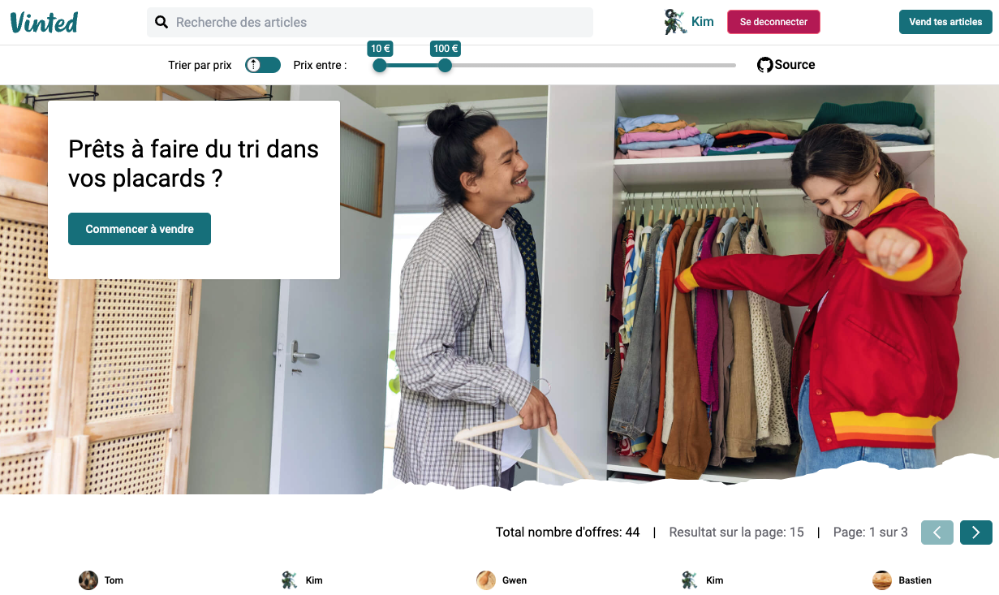

# Vinted-project (Front)

Frontend project initialize from [Le Reacteur](https://github.com/lereacteur)

This project is to make a clone as close as possible to this site [Vinted](https://www.vinted.fr/) and adding some feature like publish offers, create account, payment and reset-password.

The [backend](https://github.com/ShueiYang/vinted-api) connecting to this project.

Stacks use for this project:

* React js with Vite 
* Tailwind Css
* MongoDB  and Expressjs on the Backend

 

